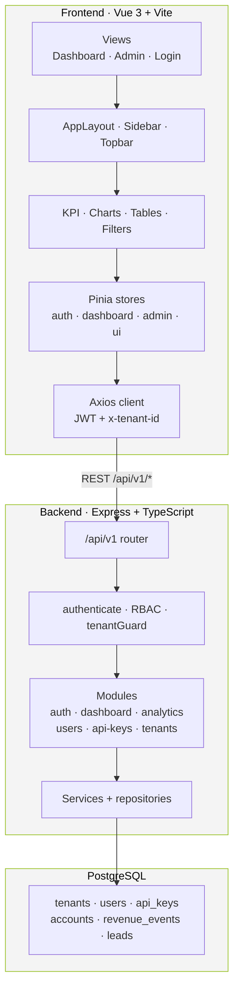

# Mesh Metrics

Unified SaaS analytics and admin platform — Vue 3 frontend + Express/Postgres backend with JWT auth, multi-tenant RBAC, and revenue dashboards.

## Structure

```
mesh-metrics/
├── api/           Vercel serverless entry (Express handler)
├── backend/       Express + TypeScript + PostgreSQL API
├── frontend/      Vue 3 + Pinia + Chart.js SPA
├── package.json   npm workspaces root
├── vercel.json    Vercel deploy config
└── docker-compose.yml
```

## Architecture



### Request flow

1. User signs in via `LoginView` → `POST /api/v1/auth/login` → JWT stored in `localStorage`.
2. Axios attaches `Authorization: Bearer …` and `x-tenant-id` on every request.
3. Express middleware validates JWT, role, and tenant isolation before hitting module handlers.
4. Dashboard and admin endpoints query Postgres (tenant-scoped) and return JSON for charts, KPIs, and tables.

## Prerequisites

- Node.js **>= 18.18**
- npm **>= 9**
- PostgreSQL (local or Docker)

## Setup

```bash
# Install all dependencies
npm install

# Backend environment
cp backend/.env.example backend/.env
# Set JWT_SECRET and DATABASE_URL (or DB_* vars)

# Frontend environment
cp frontend/.env.example frontend/.env.local
# VITE_API_BASE_URL=http://localhost:4000/api/v1

# Database
npm run db:migrate
npm run db:seed
```

## Development

Run in two terminals:

```bash
npm run dev:backend    # http://localhost:4000/api/v1
npm run dev:frontend   # http://localhost:5173
```

Or with Docker:

```bash
docker compose up -d postgres
npm run db:migrate && npm run db:seed
npm run dev:backend
npm run dev:frontend
```

## Sign in (seed user)

| Field | Value |
|-------|-------|
| Email | `admin@meshcore.local` |
| Password | `password123` |
| Tenant ID | `00000000-0000-0000-0000-000000000001` |

## API routes

| Method | Path | Auth | Description |
|--------|------|------|-------------|
| POST | `/api/v1/auth/login` | Public | JWT login |
| GET | `/api/v1/dashboard` | JWT + tenant | Revenue dashboard |
| GET | `/api/v1/analytics/summary` | JWT + tenant | Platform ops metrics |
| GET | `/api/v1/users` | JWT + tenant | Tenant users |
| GET | `/api/v1/api-keys` | JWT + tenant | API keys |
| GET | `/api/v1/health` | Public | Health check |

## Production build

```bash
npm run build
npm run start          # backend API; serve frontend/dist via nginx or static host
```

Run the API and serve `frontend/dist` from your own host (Docker Compose, VPS, PaaS, etc.).
